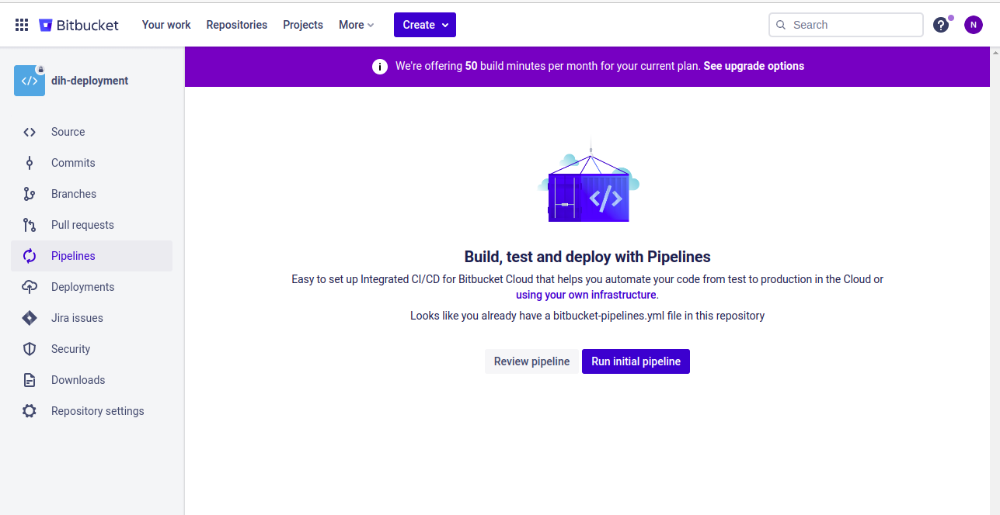

# CI/CD Integration with Smart DIH lab

## Goals:

Learn how to create CI/CD pipeline to automate space and data-feeder service deployment on Kubernetes cluster using Bitbucket

----------------

## Tasks:

1. Create EC2 Jumper & EKS Cluster
2. Create Custom Docker Image

   a. Image must have tools: Awscli, Kubectl, Helm, Maven

3. Create & Configure Repository on Bitbucket

4. Configure bitbucket-pipelines.yml

   a. Implement steps as per above diagram

5. Do Initial Push to Repository on Bitbucket

6. Test Pipeline Execution Flow


----------------

## 1. Create EC2 Jumper & EKS Cluster

1. Login to AWS console
2. Select Ireland region (eu-west-1)
3. Select EC2
4. Move to Instances page
5. On the top right corner click on the orange button (press the down arrow)
6. Click on 'Launch instance from template'
7. In Choose a launch template - search for 'CSM-LAB-EKS-JUMPER-template' (lt ID: lt-079d823907147c80b)
8. Scroll down to 'Resource tags' and modify the 'Name' tag. It's high recommended to concatenate your name (i.e: CSM-LAB-Jumper-James)
9. Click on 'Launch instance' orange button.
10. You should see a note like 'Successfully initiated launch of instance (i-xxxxxxxxxx)', click the link to move to ec2 instance page
11. Wait a few minutes for the instance to be available, locate your instance public ip.
12. Use OOTB-DIH-Provisioning.pem, make sure to grant this file the right permmisions (chmod 400 OOTB-DIH-Provisioning.pem) the pem file will be provided separately.
13. Connect to your jumper machine via: ssh -i "OOTB-DIH-Provisioning.pem" centos@Your-Public-IP
14. Run the command ./run.sh
15. cd OOTB-DIH-k8s-provisioning
16. Run: ./initGS-Lab.sh and follow the instructions
17. Verify EKS Cluster

``` 
eksctl get cluster
```

--------------

## 2.Create Custom Docker Image

1. This step is optional as we have built image pushed to hub. If you create you own image then please update same image name in bitbucket-pipelines.yml

2. Create Dockerfile with tools installation steps

   1. AWSCLI
   2. Kubectl
   3. Helm
   4. Maven

3. Use Dockerfile from <PROJECT_ROOT>/docker/Dockerfile 

4. Build and push docker (make sure you have necessary permissions to push image)
   ```
    docker build -t smart-dih-demo/pipelines-kubectl:latest . --no-cache
    docker push smart-dih-demo/pipelines-kubectl:latest
   ```

----------
## 3. Create & Configure Repository on Bitbucket

1. Signup/Login to https://bitbucket.org/

2. Create New Repository


3. Set Repository Variables (same aws credential from Jumper ec2 instance)
    ```
   Set AWS_ACCESS_KEY and AWS_SECRET_ACCESS_KEY to access your AWS environment
   ```
    

--------------
## 4. Configure bitbucket-pipelines.yml

1. Use bitbucket-pipelines.yml available at <Project_Root>/smart-dih-demo/

   **It has following sections:**

   ```
    “Image:” - You can specify a custom docker image from Docker Hub as your build environment
    “Step:” - deployment steps will be executed for each pipeline run
    “Script:” - Shell commands you need to perform when pipeline triggers
   ```

   **Pipeline Steps Explained:**
    ```
    1. Build module using “mvn clean package -DskipTests”
    2. Configure AWS and copy generated jar to S3
    3. Configure Kubectl to communicate with Eks
    4. Add Gigaspaces repo to Helm
    5. Install Manager, Space and Data-feeder using Helm
    ```
   NOTE: Use the same image tag that was build in step #2 in butbucket-pipelines.yml  

-----------------
## 5. Do Initial Push to Repository on Bitbucket

1. First, create new a repo on Bitbucket and take note of the URL (or SSH endpoint) of the new repo.

2. Clone it to local system

3. Add only "smart-dih-demo" project to bit bucket repo location (root level) and move bitbucket-pipelines.yml from smart-dih-demo/ to root level also copy pom.xml file present at root level to root of the repo. 

4. Use the same name, and aws region in the bitbucket-pipelines.yml file as used during cluster creation using eksctl.

    aws eks update-kubeconfig **--region us-east-2** **--name dih-lab** (build will fails if not set correctly)

5. Push this new project to Bitbucket repo

-------------
## 6. Test Pipeline Execution Flow

**Go to Bitbucket Dashboard -> Repository -> Pipeline <br/>
**Run Initial Pipeline


1. Edit “totalRecords” and “startId” in MyBean.java file available at smart-dih-demo/src/main/java/com/mycompany/app/MyBean.java
2. Push code changes to the Bitbucket repository
3. Monitor pipeline progress on following page


4. Once status is successful then verify deployed services on Kubernetes


5. Open Ops Web ui using url http://<external_ip_of_manager-service>:8090

    1. Deployed Services

   

    2. Space Overview

   

    3. Total entries in space

   

-------------

### As you can see, every change in the source code is captured abd deployed on kubernetes environment.

## End of Lab.