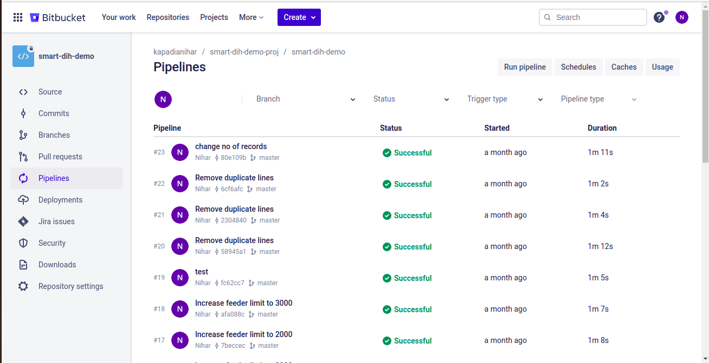
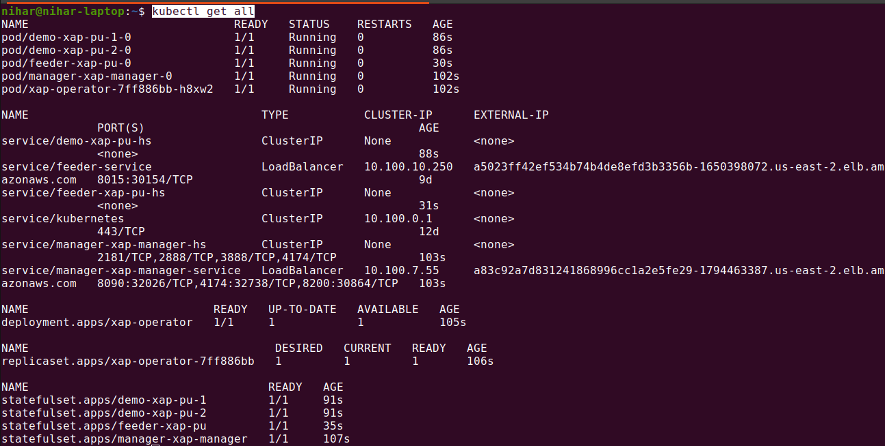
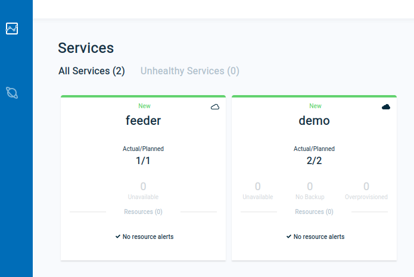
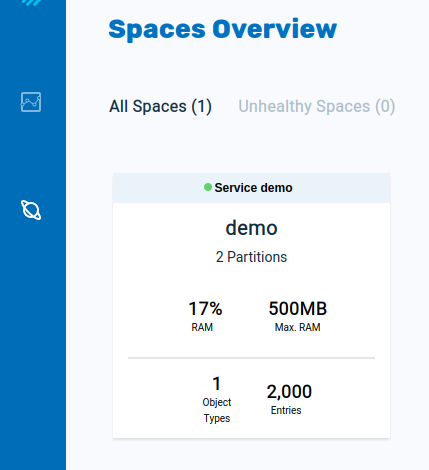

# CI/CD Integration with Smart DIH lab

## Goals:

Learn how to create CI/CD pipeline to automate space and data-feeder service deployment on Kubernetes cluster using Bitbucket

----------------

## Tasks:

1. Create EKS Cluster
2. Create Custom Docker Image

   a. Image must have tools: Awscli, Kubectl, Helm, Maven

3. Create & Configure Repository on Bitbucket

4. Configure bitbucket-pipelines.yml

   a. Implement steps as per above diagram

5. Do Initial Push to Repository on Bitbucket

6. Test Pipeline Execution Flow


----------------

## 1. Create EKS Cluster

1. Install AWSCLI </br> https://docs.aws.amazon.com/cli/latest/userguide/getting-started-install.html
2. Install Eksctl </br> https://docs.aws.amazon.com/eks/latest/userguide/eksctl.html
3. Configure AWS
    ``` 
    aws configure
    ```

4. Create EKS Cluster
    ``` 
    eksctl create cluster --name smart-dih-lab --version 1.21 --region --nodegroup-name standard-workers --node-type <ec2_instance_type> --nodes <total_nodes_count> --nodes-min 1 --nodes-max <total_nodes_count> --tags <tags_by_comma_separated>
    ```
5. Verify EKS Cluster
    ``` 
    eksctl get cluster
    ```

--------------

## 2.Create Custom Docker Image

1. Create Dockerfile with tools installation steps
   1. AWSCLI
   2. Kubectl
   3. Helm
   4. Maven

2. Use Dockerfile from <PROJECT_ROOT>/docker/Dockerfile 

3. Build and push docker
   ```
    docker build -t smart-dih-demo/pipelines-kubectl:latest . --no-cache
    docker push smart-dih-demo/pipelines-kubectl:latest
   ```

----------
## 3. Create & Configure Repository on Bitbucket

1. Signup/Login to https://bitbucket.org/

2. Create New Repository


3. Set Repository Variables
    ```
   Set AWS_ACCESS_KEY and AWS_SECRET_ACCESS_KEY to access your AWS environment
   ```


--------------
## 4. Configure bitbucket-pipelines.yml

1. Use butbucket-pipelines.yml available at <Project_Root>/smart-dih-demo/

   **It has following sections:**
   ```
    “Image:” - You can specify a custom docker image from Docker Hub as your build environment
    “Step:” - deployment steps will be executed for each pipeline run
    “Script:” - Shell commands you need to perform when pipeline triggers
    ```

   **Pipeline Steps Explained:**
    ```
    1. Build module using “mvn clean package -DskipTests”
    2. Configure AWS and copy generated jar to S3
    3. Configure Kubectl to communicate with Eks
    4. Add Gigaspaces repo to Helm
    5. Install Manager, Space and Data-feeder using Helm
    ```
NOTE: Use the same image tag that was build in step #2 in butbucket-pipelines.yml  

-----------------
## 5. Do Initial Push to Repository on Bitbucket

1. First, create new a repo on Bitbucket and take note of the URL (or SSH endpoint) of the new repo.
2. Clone it to local system
3. Add only "smart-dih-demo" project to bit bucket repo location (root level) and move bitbucket-pipelines.yml from smart-dih-demo/ to root level
4. Push this new project to Bitbucket repo

-------------
## 6. Test Pipeline Execution Flow

**Go to Bitbucket Dashboard -> Repository -> Pipeline <br/>
**Run Initial Pipeline


1. Edit “totalRecords” and “startId” in MyBean.java file available at smart-dih-demo/src/main/java/com/mycompany/app/MyBean.java
2. Push code changes to the Bitbucket repository
3. Monitor pipeline progress on following page



4. Once status is successful then verify deployed services on Kubernetes



5. Open Ops Web ui using url http://<external_ip_of_manager-service>:8090

    1. Deployed Services

   

    2. Space Overview

   

    3. Total entries in space

   

-------------

### As you can see, every change in the source code is captured abd deployed on kubernetes environment.

## End of Lab.